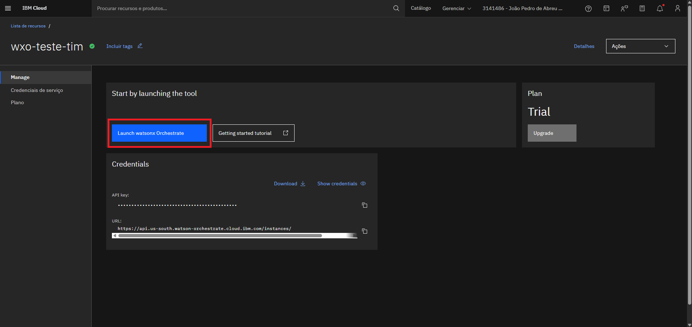
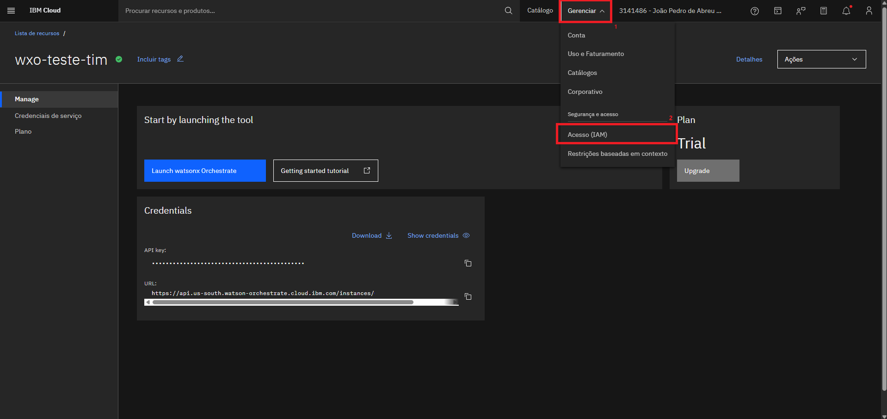
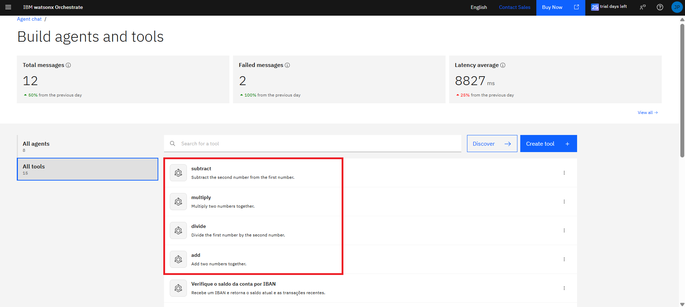
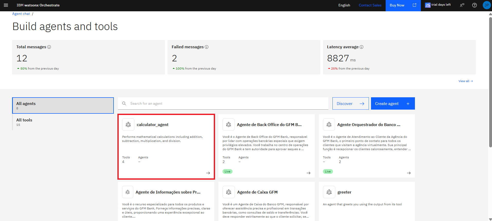
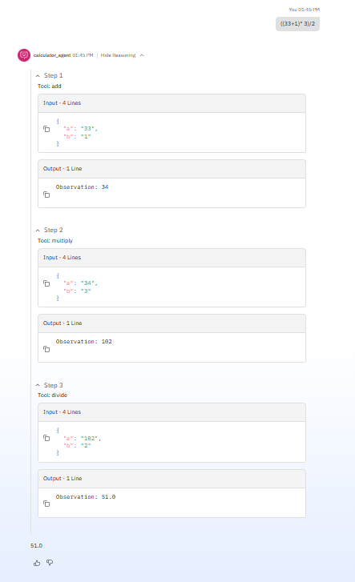

# Anotações - Watson X Orchestrate

## 1. Como criar uma instância do Orchestrate na IBM Cloud?

O primeiro passo para criar a sua instância do WatsonX Orchestrate é criar uma conta na IBM Cloud. Após o acesso, o usuário será encaminha para a página inicial da plataforma, conhecida como Dashboard. Nessa página, clicar no botão destacado em vermelho **Criar recurso**.


Nesse momento você será deslocado para o catálogo de produtos oferecidos dentro da plataforma. Na barra de pesquisa, basta digitar *"orchestrate"* e nas opções que aparecem logo abaixo, clique naquela que diz respeito ao WatsonX Orchestrate (destacado em vermelho).


Você será redirecionado para uma página onde deve definir algumas configurações da instância, como a região em que ela será alocada, bem como o nome da instância, grupo de recursos e tags. Por fim, irá clicar no botão **Criar** para iniciar o processo de criação da instância.

- A IBM Cloud oferece um trial de 30 dias do produto.


Após clicar no botão para criar a instância, logo você é encaminhado para dentro dela na página inicial do Orchestrate. Porém, vou mostrar como chegar nessa mesma página a partir da página inicial da plataforma. A partir da página Dashboard, apresentada na primeira imagem, clicar no menu de hambúrguer no campo superior esquerdo e selecionar a opção **Lista de Recursos**. A página de destino traz todos os recursos da IBM Cloud que você possui instanciados na conta do qual você faz parte. O WatsonX Orchestrate está dentro da seção **AI/Aprendizado de máquina**.


Nessa próxima página, clicar em **Launch watsonx Orchestrate**.



Por fim, agora estamos na página inicial da instância que criamos do Watson Orchestrate.


## 2. Como criar seu primeiro agente pela interface gráfica (No code)?

Nesse primeiro exemplo vamos criar o Agent a partir da interface gráfica. Na página inicial da sua instância do Orchestrate, selecionar o menu hambúrguer no campo superior esquerdo e dentro do submenu **Build**, selecionar a opção **Agent Builder**.


Você será redirecionado para uma página onde é possível visualizar todos os seus agentes (*agents*) e ferramentas (*tools*) criados, além de métricas como quantidade de mensagens trocadas pelos agentes, falhas identificadas e latência na comunicação. Para criar um novo agente, basta clicar em **Create agent**.


O primeiro passo é definir se você deseja criar o agente do zero (*from scratch*) ou se quer reaproveitar algum outro template já existente. Em seguida é preciso definir um nome para o agente e por último uma descrição. Clicar em **Create** para ir para a próxima etapa.

- A descrição não ira determinar o comportamento (*behavior*) do seu agente. Ele serve para delimitar o escopo do agente e ajudar outros agentes a entender para que ele serve para no caso de necessidade, fazer a melhor escolha por qual a gente chamar para uma determinada tarefa.

- A descrição deve conter o propósito do agente, e as ferramentas e outros agentes que ele se comunica.


Já na página onde iremos definir as principais configurações do a gente, no primeiro quadrado podemos definir qual modelo de IA o nosso a gente irá utilizar. Via interface gráfica as opções são mais limitadas, mas no caso do a gente ser configurado em Pro Code, há mais opções de modelos disponíveis. Em **Welcome Message**, a mensagem definida irá substituir *"Hello, welcome to watsonx Orchestrate"*.


Podemos definir em **Quick start prompts** alguns exemplos de prompts para mostrar para o usuário algumas opções do que ele pode solicitar para o agente.


Em **Knowledge**, é onde definimos a base de conhecimento do nosso agente, fornecendo os arquivos que ele terá acesso para consulta. Para adicionar uma nova base clicamos em **Choose knowledge**. Em **Edit knowledge settings**, podemos alterar alguns parâmetros referentes as bases.


Devemos escolher que tipo de base de conhecimento desejamos importar. Podemos inserir um arquivo diretamente nessa interface ou apontar para repositórios externos, como um storage.


No nosso exemplo escolhemos a opção **Upload files**, onde anexamos os arquivos diretamente pela interface do Orchestrate.


Após adicionar o arquivo, devemos colocar uma descrição para que o agente saiba para que serve aquele documento. Para submeter essa base de conhecimento, basta clicar em **Save**.


Em **Toolset** definimos as ferramentas que o nosso a gente terá acesso, como por exemplo, uma API ou serviço que ele irá consumir dados. Para criar uma nova ferramenta clicamos em **Add tool**.


Temos várias opções de ferramentas:

1. Podemos adicionar uma ferramenta diretamente do catálogo. A plataforma oferece integração com diversas ferramentas de mercado, como por exemplo, o Service Now em poucos passos, sem a necessidade de se configurar tudo manualmente;

2. Para o caso de adicionar ferramentas da instância local, essa está disponível apenas na versão *On Premises* do Orchestrate e permite adicionar programas que são executados no mesmo ambiente;

3. A opção de adicionar por arquivo ou MCP server permite integrar uma API a partir do seu swagger;

4. Por último, na opção *Agentic Worflow*, é possível construir um fluxo diretamente pela interface do Orchestrate utilizando caixas com drag-and-drop codificáveis e que se integram com outras *Tools* e *Agents*.


No nosso caso, optamos pela criação da ferramenta a partir de um arquivo.


Para isso importamos o YAML do Swagger da nossa API e automaticamente o Orchestrate já identificou todos os endpoints que existem dentro dele. Podemos selecionar apenas aqueles que desejamos que sejam inseridos no nosso agente.


Cada endpoint será considerado uma ferramenta, e todos eles estarão disponíveis para serem consumidos por outros agentes. É importante que os endpoints estejam bem descritos na documentação para que o agente tenha ciência do que cada um deles faz.


Além das ferramentas, podemos definir também outros agentes que o nosso pode se comunicar. Nesse exemplo vamos seguir apenas com um único agente, porém, esse caso será de extrema importância quando estivermos falando sobre arquiteturas de multiagentes.


Na seção de **Behavior** (comportamento), é onde vamos inserir o prompt que descreve como nosso agente deve funcionar, indicando o seu contexto, orientando as situações em que ele deve utilizar cada uma das bases de conhecimentos, ferramentas e agentes configurados, definindo como ele deve se comportar em determinadas situações e se necessário, definindo os limites de atuação (*guard-rails*). Esses comportamentos também podem ser configurados na seção de **Guidelines**.


Por último, definimos por qual canal aquele agente ira se comunicar (Teams, Facebook, API etc.).


Para publicar o seu agente você deve clicar em **Deploy**. Nesse momento um modal trazendo a revisão dos conteúdos inseridos. Caso esteja tudo ok, clique novamente em **Deploy**.


Seremos redirecionados novamente para a página do Orchestrate que contém todos os nossos agentes e ferramentas criados. Podemos perceber que o agente que acabamos de criar já aparece e contém uma tag de `Live`, o que indica que ele já está rodando.


Seja durante a fase de configuração ou após a publicação, podemos testar o nosso agente enviando prompts e verificando se ele está atuando da forma esperada.

Para validar se ele está atuando corretamente, podemos expandir a seção de *reasoning* (raciocínio) para entender de qual base de conhecimento, ferramenta ou agente ele retirou aquela resposta.


### 2.1. Criando uma Solução Multiagente

Em um próximo exercício, a ideia era construir um agente que auxiliasse nas tarefas de um banco, o GFM Bank. Esse banco contava com funcionários de diferentes áreas que desempenhavam diversas operações: O pessoal do caixa trabalhava com consulta de saldo e transferências. Quando era necessário mexer com cheque especial (solicitar ou desabilitar) ou pedir a reversão de uma transferência, o pessoal do caixa deveria encaminhar para o time de Backoffice. Quando haviam dúvidas sobre os produtos oferecidos pelo banco, era necessário encaminhar para os especialistas de produto. Essas operações demoravam horas e exigiam do cliente entrar em contato com diversas pessoas. A ideia nesse exercício então foi implementar uma solução onde cada uma dessas áreas era de responsabilidades de um agente e todos eles eram coordenados por um agente orquestrador.


Na página onde podemos visualizar todos os agentes e ferramentas que a nossa instância possui, podemos ver a presença de quatro agentes destacados em cores diferentes. Os destacados em laranja são os agentes especializados, isto é, são aqueles que serão invocados pelo agente orquestrador quando este identificar que a tarefa solicitada pelo usuário pode ser resolvida por um determinado agente especialista. O destacado em vermelho é o agente orquestrador, que é aquele que irá interagir diretamente com o usuário e receber as solicitações.


Para que os agentes especialistas não fiquem disponíveis para o usuário via interface do WatsonX Orchestrate, na sua configuração devemos desabilitar a opção **Home Page** em **Channels**.


Na seção **Agents**, devemos configurar todos os agentes que o nosso orquestrador pode se comunicar. Mesmo que existam mais agentes dentro da nossa instância do Orchestrate, o nosso agente só visualizará àqueles que foram configurados nessa etapa.

- Vemos que apenas dois agentes foram configurados. Isso porque se olharmos para o desenho da arquitetura da solução, vimos que o orquestrador não se comunica diretamente com o agente de Backoffice, sendo isso responsabilidade do agente de caixa.


Quando clicamos em **Add agent** temos a opção de adicionar um agente do catálogo (por exemplo, uma integração com o Service Now sem a necessidade de você construir essa comunicação na mão), um agente da sua instância (que é o nosso caso), ou agentes externos.


Se voltarmos na página inicial do Orchestrate onde podemos interagir via chat com os nosso assistentes, vamos ver que apenas o agente orquestrador estará disponível para conversa, como já era esperado.


## 3. Como criar seu primeiro agente via ADK (Pro code)?

O IBM watsonx Orchestrate Agent Development Kit (ADK) é um conjunto de ferramentas (biblioteca Python e comandos na CLI) que permitem a construção e o deploy de *agents* e *tools* para o IBM watsonx Orchestrate de forma programática.

### 3.1. Instalando o ADK

Para facilitar a experiência, foi criado uma imagem Docker que automatiza a criação do ambiente do ADK.

Primeiramente vamos entender o que a [imagem](./adk/Dockerfile) configura no ambiente:

- Como explicado na definição do ADK, ele é formado por um conjunto de ferramentas, incluindo uma biblioteca Python. Sendo assim, a imagem base utilizada é a do Python na versão 3.13. Atualmente, o ADK está disponível a partir da versão 3.11;

- Em seguida é criado e definido `wxo-adk` como o diretório de trabalho, onde serão depositados nossos projetos que forem desenvolvidos;

- Em seguidas são executados três comandos sequencialmente: o primeiro instala a biblioteca do Orchestrate utilizando o gerenciador de pacotes `pip` do Python. O segundo comando cria um ambiente de desenvolvimento local também com o nome `wxo-adk` e esse ambiente é relacionado a nossa instância do Orchestrate na IBM Cloud. Será mostrado como obter o endereço da nossa instância pela Cloud e como passar esse valor como argumento no `build` da imagem. Por último, é feito um comando para ativar o ambiente e passar a API Key de autenticação. Assim como o endereço da instância, a API Key é obtida pela Cloud e passada como argumento no `build` da imagem.

- Comando para fazer o `build` da imagem Docker (é preciso estar dentro do diretório `adk`):

  ```Docker
  docker build --build-arg WXO_INSTANCE=<URL_INSTANCIA> --build-arg WXO_API_KEY=<API_KEY_CLOUD> -t wxo-adk .
  ```

  - Para obter a URL da instância:

    

  - Para obter a API Key, será necessário acessar a página de IAM da sua conta IBM Cloud e gerar uma nova chave de API:

    - **Dica:** Possivelmente você pode precisar dessa API Key várias vezes para ficar reativando o ambiente que por algum motivo, talvez inatividade, caia constantemente. Portanto, quando gerar a nova API Key, faça o download dela e jogue dentro do diretório desse projeto, pois, apesar de ser um arquivo sensível e que não deve ficar exposto no seu repositório, já existe um arquivo `.gitignore` configurado para não permitir que esse arquivo vá pro seu repositório online quando você fizer um `push`.

    

    

Após a geração da imagem, agora devemos subir o container do nosso ambiente do ADK utilizando o [compose](./adk/docker-compose.yaml). Para isso também é preciso estar dentro do diretório `adk`:

```Docker
docker-compose up -d
```

Após a criação do ambiente, para acessá-lo, executamos:

```Docker
docker container exec -it wxo-adk sh
```

Para validarmos que estamos dentro do ambiente do ADK, executamos:

```ADK
orchestrate env list
```

- E obtemos o seguinte resultado que evidencia que de fato estamos no ambiente do ADK:

  

### 3.2. Criando agente pelo ADK

De dentro do container do nosso ambiente do ADK, antes de criarmos nosso agente, vamos executar alguns comandos para criar o sistema de arquivos da nossa aplicação:

```Linux
mkdir -p /wxo-adk/calculator/tools
touch /wxo-adk/calculator/calculator_agent.yaml
touch /wxo-adk/calculator/tools/calculator_tool.py
```

- Por questões de organização, o agente da solução deve ficar na pasta raiz do projeto (`calculator`), enquanto as ferramentas utilizadas por ele devem ter seus próprios diretórios (`tools`, `agents`, `knowledge` etc.)

Com isso podemos iniciar a criação do nosso agente. O primeiro passo é criar as nossas tools, copiando o conteúdo abaixo para dentro do arquivo `tools/calculator_tool.py`:

```Python
from ibm_watsonx_orchestrate.agent_builder.tools import tool

@tool
def add(a: float, b: float) -> float:
    """
    Add two numbers together.
    
    :param a: The first number to add
    :param b: The second number to add
    :returns: The sum of a and b
    """
    return a + b

@tool
def subtract(a: float, b: float) -> float:
    """
    Subtract the second number from the first number.
    
    :param a: The number to subtract from
    :param b: The number to subtract
    :returns: The difference of a and b
    """
    return a - b

@tool
def multiply(a: float, b: float) -> float:
    """
    Multiply two numbers together.
    
    :param a: The first number to multiply
    :param b: The second number to multiply
    :returns: The product of a and b
    """
    return a * b

@tool
def divide(a: float, b: float) -> float:
    """
    Divide the first number by the second number.
    
    :param a: The dividend (number to be divided)
    :param b: The divisor (number to divide by)
    :returns: The quotient of a divided by b
    """
    if b == 0:
        raise ValueError("Cannot divide by zero")
    return a / b
```

- No exemplo da interface gráfica vimos a criação da tool a partir do Swagger de uma API que estava disponível na web. Porém, também podemos importar um script Python e este será executado dentro da Cloud;

- No início do script é preciso importar a biblioteca do Orchestrate para Python e em cada função que será uma tool, adicionar o marcador `@tool` logo acima dela;

- Logo após a assinatura da função, inserimos um comentário de múltiplas linhas descrevendo o que aquela ferramenta faz. Relembrando que esse passo é de extrema importância para que o agente tenha noção da atividade que aquela ferramenta se propõe a resolver para conseguir rotear os problemas para ela corretamente;

- Após o comentário há o código Python da nossa ferramenta, que no caso são quatro funções, cada uma representando uma operação matemática (soma, subtração, multiplicação e divisão).

Com o desenvolvimento finalizado, agora devemos importar as ferramentas para a nossa instância do Orchestrate na Cloud:

- Comando:

  ```WatsonX Orchestrate
  orchestrate tools import -k python -f tools/calculator_tool.py
  ```

- Resposta:

  ```WatsonX Orchestrate
  [INFO] - Tool 'add' imported successfully
  [INFO] - Tool 'divide' imported successfully
  [INFO] - Tool 'multiply' imported successfully
  [INFO] - Tool 'subtract' imported successfully
  ```

- Interface Gráfica:

  

Após a criação das ferramentas, podemos então criar o nosso agente, copiando o seguinte conteúdo para dentro do arquivo `calculator_agent.yaml`:

```YAML
spec_version: v1
kind: native
name: calculator_agent
description: Performs mathematical calculations including addition, subtraction, multiplication, and division.
style: react
llm: watsonx/meta-llama/llama-3-2-90b-vision-instruct
instructions: |
  You are a calculator agent that can perform basic mathematical operations.
  
  • When asked to add or sum numbers, call the `add` tool
  • When asked to subtract numbers, call the `subtract` tool  
  • When asked to multiply numbers, call the `multiply` tool
  • When asked to divide numbers, call the `divide` tool
  
  Always use the appropriate tool for the mathematical operation requested.
  Do NOT compute results yourself - always use the tools.
  After the tool returns a result, present it clearly to the user.
  
  Handle these types of requests:
  - "add 5 and 3" or "5 + 3" → use add tool
  - "subtract 10 from 15" or "15 - 10" → use subtract tool
  - "multiply 4 by 6" or "4 * 6" → use multiply tool
  - "divide 20 by 4" or "20 / 4" → use divide tool
tools:
  - add
  - subtract
  - multiply
  - divide
```

- No arquivo apresentado acima, fazemos as mesmas configurações vistas anteriormente pela interface gráfica: definimos um nome pro nosso agente (`name`), uma descrição (`description`), o estilo (`style`), o modelo (`llm`), o comportamento (`instructions`) e as ferramentas (`tools`);

- Não aparecem nesse arquivo pois não foram contemplados no exemplo acima, mas também podemos configurar a mensagem de boas-vindas (`welcome_content`), os prompts de início (`starter_prompts`), outros agentes colaborativos (`collaboratos`) e definir bases de conhecimento (`knowledge_base`);

- Para entender como cada um desses atributos funcionam, basta acessar a documentação oficial do ADK. Link referenciado no final desse arquivo;

- Como mencionado na construção do agente via interface gráfica, as opções por lá de modelos são mais limitadas, enquanto aqui pelo ADK existem mais opções. Para conhecer todas as disponíveis, basta executar o seguinte comando:

  ```WatsonX Orchestrate
  orchestrate models list
  ```

Com o desenvolvimento finalizado, agora devemos importar o agente para a nossa instância do Orchestrate na Cloud:

- Comando:

  ```WatsonX Orchestrate
  orchestrate agents import -f calculator_agent.yaml
  ```

- Resposta:

  ```WatsonX Orchestrate
  [INFO] - Agent 'calculator_agent' imported successfully
  ```

- Interface Gráfica:

  

Executando esse agente pela interface da cloud e expandindo seu *reasoning*, podemos ver ele chamando cada uma das ferramentas para cada uma das etapas de resolução da equação matemática, inclusive respeitando a ordem de prioridade das operações:



## 4. Links

- [Documentação WatsonX Orchestrate](https://www.ibm.com/docs/en/watsonx/watson-orchestrate/base)

- [Documentação WatsonX Orchestrate ADK](https://developer.watson-orchestrate.ibm.com/)

- [Repositório GitHub do Bootcamp](https://github.com/bootcampwxo/bootcampwxo/tree/main)

- [From Zero to Hero](https://ruslanmv.com/blog/hello-watsonx-orchestrate)
